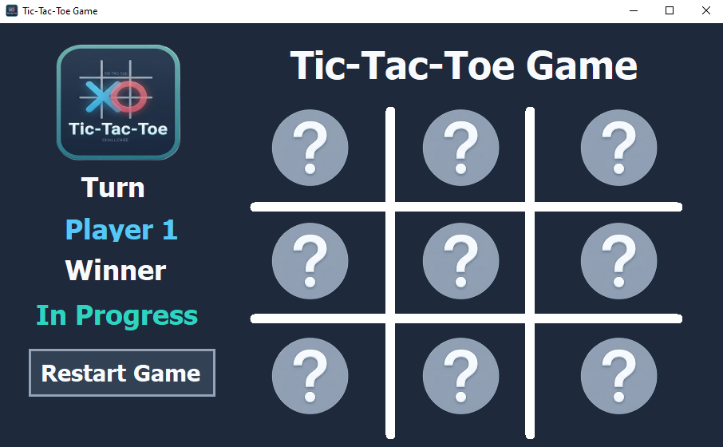
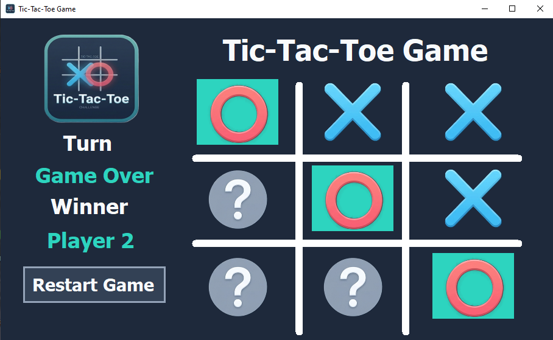
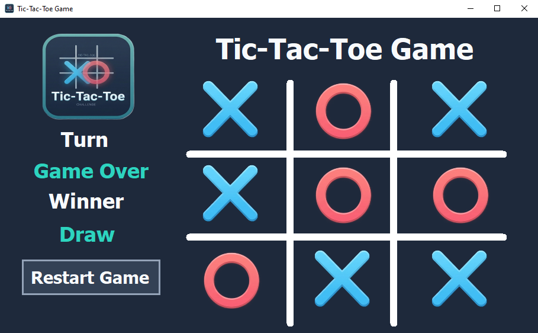

# Tic-Tac-Toe-Project
A classic Tic-Tac-Toe desktop application developed using C# and Windows Forms. This project demonstrates basic game logic implementation, event handling, and UI design in a .NET environment.

## 📌 Overview
This project is a **Tic Tac Toe (XO)** desktop application built using **C# and Windows Forms**.  
It provides a simple and interactive 2-player gameplay experience with a clean UI and real-time game state updates.

## 📸 Screenshot




---

## ✨ Features
- 🧑‍🤝‍🧑 Two-player mode (Player 1 vs Player 2)
- ❌⭕ Dynamic X and O placement
- 🎯 Automatic winner detection
- 🤝 Draw detection
- 🔄 Reset game functionality
- 🎨 Visual highlighting of winning combination
- 📢 Game-over notifications

---

## 🛠️ Technologies Used
- **Language:** C#
- **Framework:** .NET Windows Forms
- **IDE:** Visual Studio
- **UI Components:**  
  - `PictureBox` for game cells  
  - `Label` for status display  
  - `Button` for reset  

---

## 🎮 How to Play
1. The game starts with **Player 1 (X)**.
2. Players take turns clicking on empty cells.
3. The first player to align 3 symbols (row, column, or diagonal) wins.
4. If all cells are filled without a winner → **Draw**.
5. Click **Reset** to start a new game.

---

## 🧠 Game Logic Overview

### 🔄 Turn Handling
- The game alternates between:
  - `Player 1 → X`
  - `Player 2 → O`
- Each click:
  - Sets the image (X or O)
  - Disables the clicked cell
  - Switches turn

---

### 🏆 Winner Detection
The system checks:
- Rows (3)
- Columns (3)
- Diagonals (2)

If 3 matching values are found:
- Cells are highlighted
- Game is stopped
- Winner is announced

---

### ⚖️ Draw Condition
If all cells are filled and no winner:
- Game ends as **Draw**

---

## 🔑 Key Methods

### `Change_Image(object sender)`
Handles:
- Player moves
- Image assignment (X / O)
- Turn switching
- Winner check trigger

---

### `Check_Winner()`
Evaluates:
- All winning combinations
- Draw condition

---

### `Check_Value(PictureBox pb1, pb2, pb3)`
- Verifies if 3 cells match
- Highlights winning cells
- Displays winner

---

### `Disable_pb()`
- Disables all cells after game ends

---

### `Reset_Button(object sender)`
- Resets each cell:
  - Enables it
  - Clears image
  - Resets tag

---

## 🔄 Reset Functionality
- Clears the board
- Resets all cells
- Sets:
  - Turn → Player 1
  - Status → In Progress

---

## 📂 Project Structure
```
Tic_Tac_Toe_Project/
│
├── Form1.cs          # Main game logic
├── Form1.Designer.cs
├── Resources/        # Game images (X, O, empty)
└── Program.cs        # Entry point
```
---
## Download & Play
- 👉 Download the latest version from the Releases section
- 👉 Extract the archive (if needed)
- 👉 Run the executable — no installation required

---

## 📜 License
This project is open-source and available for educational purposes.

---

## 👨‍💻 Author
Developed as a Windows Forms practice project to demonstrate:
- Event-driven programming
- UI handling
- Game logic implementation
